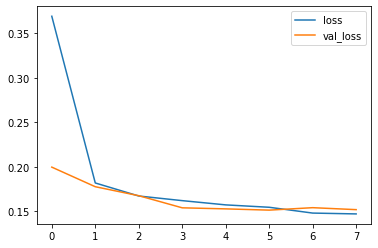

# Malaria-Diagnosis-using-CNN
Classifying cell images into infected and uninfected using Convolutional Neural Networks

## Convolutional Neural Networks
Convolutional Neural Networks (CNNs) is a class of Artificial Neural Networks (ANNs) with its major applications in Computer Vision and Deep Learning. CNNs take in an image as input and assign weights and biases to various different aspects of the image such lines, points, shape, color etc. Convolutional Neural Networks mainly consists of three different layers, the **convolution layer**, **pooling layer** and the **flatten layer**.

The convolution layer applies a simple filter (also called kernel) to an input that results in an activation and its repeated application would lead to a feature map, which indicates the location and strength of the features in the input image.

The pooling layer reduces the size of the feature matrix so that it is computationally efficient to process the data. Pooling can be of two types, Max Pooling (returns the maximum value in the portion covered by the kernel) and Average Pooling (returns the average value of portion covered by the kernel).

Finally the flatten layer converts the data into a 1 dimensional array which could then be used as an input to the further dense layers in the model.

## Goal
Given images of cells along with the label of being infected or uninfected, we would build a convolutional neural network model which could diagnose images based on the different features on which it was trained.

## Requirements
This project requires **Python** and the following Python libraries installed:

- [NumPy](http://www.numpy.org/)
- [Pandas](http://pandas.pydata.org/)
- [matplotlib](http://matplotlib.org/)
- [seaborn](https://seaborn.pydata.org/)
- [scikit-learn](http://scikit-learn.org/stable/)
- [tensorflow](https://www.tensorflow.org/)

You will also need to have software installed to run and execute a [Jupyter Notebook](http://jupyter.org/install.html).

If you do not have Python installed yet, it is highly recommended that you install the [Anaconda](https://www.anaconda.com/download/) distribution of Python  which already has the above packages and more included. However if you wish to run it online rather than your local machine you can use [Google Colab](https://colab.research.google.com/) which also has the necessary packages installed.

## Data

I have used the malaria dataset that is available on the official website of NIH([here](https://lhncbc.nlm.nih.gov/LHC-downloads/downloads.html#malaria-datasets)). It contains about 28000 images equal instances of infected and uninfected cells. We would split the data into training and testing set and train our convolutional neural network on the training dataset.

## Code
There is a single notebook file in the project which contains the code for image preprocessing, model creation and model training. The preprocessing stage includes image resizing and modifying the directory structure for the ImageDataGenerator class. I have trained a sequential model with 4 pairs of convolution and pooling layers followed by flatten and dense layers.

## Results

Plot of training loss and validation loss vs the number of epochs

Plot of training accuracy and validation accuracy vs the number of epochs

## Author

Myself Dhwanil Shah, pursuing my Btech (currently 3rd year) from DA-IICT, Gandhinagar and I'm passionate about Data science, Machine learning and Deep Learning. You can find me on [Linkedin](https://www.linkedin.com/in/dhwanil-shah-a115821ab/), I would love to collaborate on projects related to DS, ML and DL.
